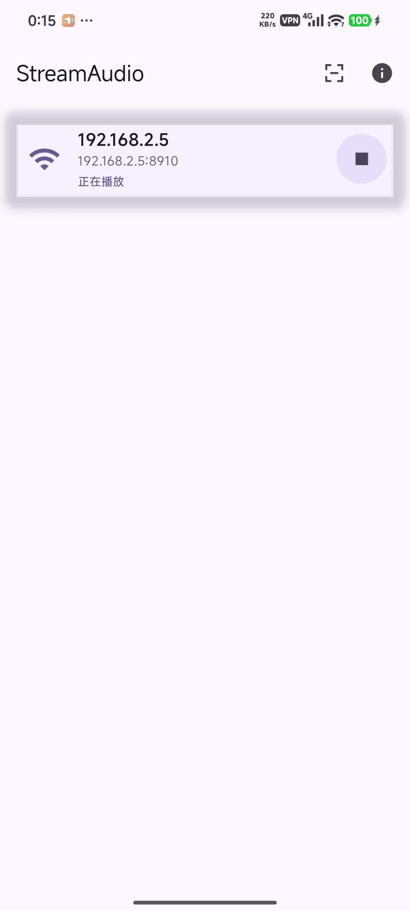
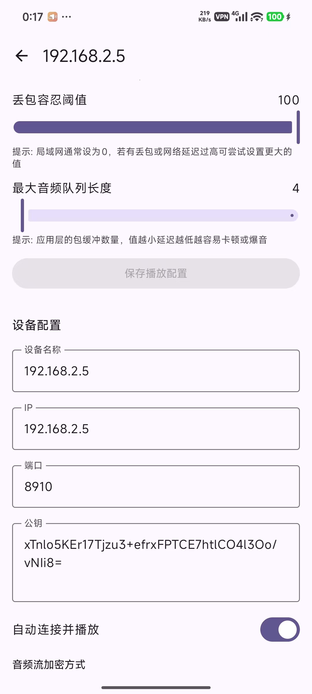

# StreamAudio Android

Android 客户端工程，用于接收并播放来自 StreamAudio 服务器的音频流。  
服务端仓库地址：[https://github.com/bit8192/StreamAudio](https://github.com/bit8192/StreamAudio)

## 环境要求
- Android Studio（推荐最新稳定版）
- Android Gradle Plugin / Gradle Wrapper（使用仓库自带）

## 构建与运行
1. 打开 Android Studio，选择 `StreamAudioAndroid/` 目录作为项目根目录。
2. 等待 Gradle 同步完成。
3. 连接真机或启动模拟器，点击 **Run** 运行。

命令行构建（可选）：
```bash
./gradlew assembleDebug
```

## 主要功能
- 扫码配对设备
- 设备列表与连接状态展示
- 设备详情与播放控制
- 后台音频播放服务

## 截图




## 目录结构简述
- `app/src/main/java/`：应用业务与 UI（Jetpack Compose）
- `app/src/main/res/`：资源文件（strings、icons 等）
- `app/src/main/cpp/`：音频播放相关 JNI/NDK 代码

## 开源协议
本项目使用 GPL-3.0，详见 `LICENSE`。
